# La Abadía del Eclipse

Diorama de cubos texturizados renderizado con un raytracer escrito desde cero en
Rust, que se ejecuta **enteramente en la CPU** y **no usa ninguna biblioteca
externa**: ni de runtime, ni de desarrollo, ni de compilación.

Una pequeña abadía medieval abandonada al anochecer. La nave tiene la fachada
abierta y el muro izquierdo derrumbado, de modo que se ve el interior; el
rosetón se enciende con la luz de los hachones que cuelgan dentro; y un estanque
en primer plano devuelve la arquitectura y los faroles mientras deja ver las
piedras del fondo a través del agua.

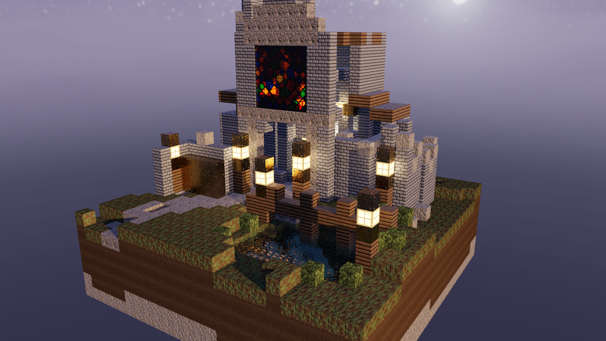

*Render real del programa: 1400 × 788, 25 muestras por píxel, profundidad 8.
Generada con `cargo run --release -- render`.*

---

## Índice

- [Qué hace y qué no](#qué-hace-y-qué-no)
- [Requisitos y compilación](#requisitos-y-compilación)
- [Cómo ejecutarlo](#cómo-ejecutarlo)
- [Controles de la ventana](#controles-de-la-ventana)
- [Video demostrativo](#video-demostrativo)
- [Arquitectura del código](#arquitectura-del-código)
- [Materiales](#materiales)
- [Cómo está implementado cada efecto](#cómo-está-implementado-cada-efecto)
- [Terreno procedural](#terreno-procedural)
- [Mediciones reales](#mediciones-reales)
- [Pruebas](#pruebas)
- [Tabla de rúbrica y evidencias](#tabla-de-rúbrica-y-evidencias)
- [Limitaciones conocidas](#limitaciones-conocidas)

---

## Qué hace y qué no

**Hace**, todo sobre la biblioteca estándar:

- Álgebra vectorial, intersecciones, texturas, materiales y sombreado.
- Una rejilla voxel con recorrido DDA como estructura de aceleración.
- Reflexión recursiva, refracción por la ley de Snell, reflexión interna total y
  Fresnel de Schlick, con absorción de Beer‑Lambert dentro de los medios.
- Generación de sus propias texturas y mapas normales, escritas como PPM.
- Lectura y escritura de PPM y **escritura de PNG completa**, con filtrado
  adaptativo, `deflate` con Huffman fijo y LZ77, CRC‑32 y Adler‑32.
- **Escritura de GIF animado**, con cuantización por corte de la mediana y LZW.
- Paralelismo con los hilos de `std`.
- Una ventana nativa de Windows por FFI directo, que solo presenta el
  framebuffer ya calculado.

**No hace**: no usa la GPU para nada del render. No hay contexto gráfico,
shaders, CUDA, OpenCL, Vulkan ni OpenGL. La ventana copia a pantalla un mapa de
bits que vive en memoria principal.

El `Cargo.toml` declara las tres tablas de dependencias vacías de forma
explícita, así que `cargo build` funciona sin descargar ni un solo crate.

---

## Requisitos y compilación

- Rust estable 1.70 o posterior. Desarrollado y medido con 1.97.1.
- No hace falta red: no hay dependencias que descargar.

```bash
git clone https://github.com/hmndz3/RayTracingP2.git
cd RayTracingP2
cargo build --release
```

Comprobaciones:

```bash
cargo test
cargo clippy --all-targets
cargo fmt --check
```

---

## Cómo ejecutarlo

### Render a fichero

Es el modo principal y es **independiente del sistema operativo**: no toca la
ventana ni ninguna API nativa.

```bash
cargo run --release -- render --width 1400 --height 788 --samples 25 --depth 8 --out docs/images/abadia.png
```

Opciones útiles:

```bash
# Otra semilla del terreno procedural
cargo run --release -- render --seed 987654 --out otra-isla.png

# Otro punto de vista
cargo run --release -- render --yaw -95 --pitch 17 --distance 38 --target 11,9.5,11.5 --out lateral.png

# Comparación con y sin mapas normales, mismo encuadre
cargo run --release -- normals-compare --yaw -196 --pitch 9 --distance 17 --target 9,10.5,13 --out docs/images/normales.png
```

La extensión decide el formato: `.ppm` escribe PPM binario y cualquier otra cosa
escribe PNG.

### Ventana interactiva

```bash
cargo run --release -- window --width 1280 --height 720
```

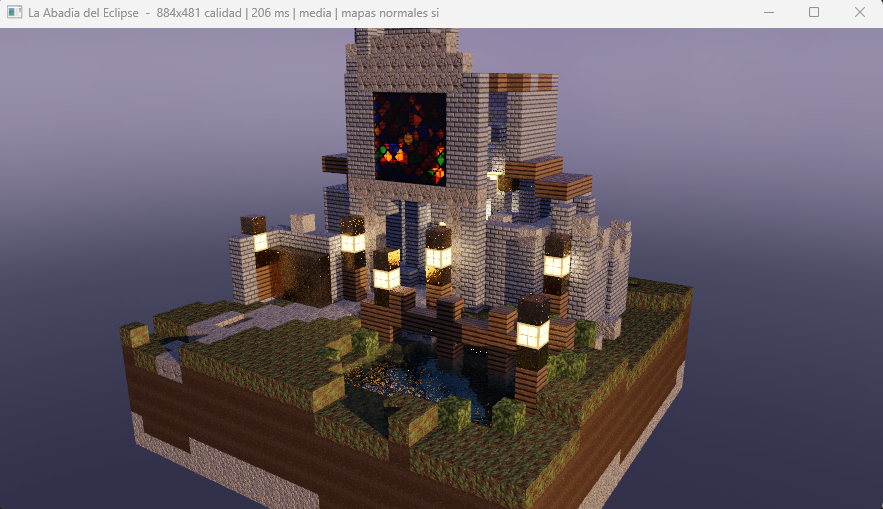

*Captura de pantalla de la ventana en marcha. El título va informando del estado:
resolución del último cuadro presentado, si es el render de vista o el de
calidad, cuánto ha tardado y si los mapas normales están activos.*

### Recorrido, animación y medición

```bash
# Secuencia de fotogramas del guion demostrativo
cargo run --release -- tour --width 854 --height 480 --samples 16 --frames 150 --out docs/tour

# El mismo recorrido como GIF animado
cargo run --release -- gif --width 480 --height 270 --samples 9 --frames 96 --out docs/images/recorrido.gif

# Medición de rendimiento
cargo run --release -- benchmark
```

### Regenerar los recursos gráficos

Las texturas y el cubemap **ya están en el repositorio**, así que esto solo hace
falta si se modifica el generador:

```bash
cargo run --release -- textures --previews docs/images/textures
```

Ayuda completa con `cargo run --release -- --help`.

---

## Controles de la ventana

| Tecla | Acción |
| --- | --- |
| Flechas, o arrastrar con el botón izquierdo | Girar la cámara en azimut y elevación |
| Rueda del ratón, `+`, `-` | Acercar y alejar |
| `R` | Restablecer la vista inicial |
| `1` `2` `3` | Calidad de la vista interactiva (baja, media, alta) |
| `N` | Activar o desactivar los mapas normales |
| `T` o espacio | Recorrido automático |
| `P` | Guardar una captura PNG |
| `Esc` o `Q` | Salir |

La ventana **sigue respondiendo mientras se renderiza**. Al mover la cámara se
cancela el trabajo en curso y se pide uno nuevo a resolución reducida; cuando la
cámara lleva 420 ms quieta se lanza el render a resolución completa. Los
resultados de una petición ya obsoleta se descartan por número de generación, de
modo que un render viejo no puede pisar a uno más reciente.

---

## Video demostrativo

### ▶ [docs/video/abadia-del-eclipse.mp4](docs/video/abadia-del-eclipse.mp4)

**20 segundos, 1280 × 720, 25 fotogramas por segundo.** GitHub lo reproduce al
abrir el enlace.

Los 500 fotogramas los exporta el propio raytracer con `abadia tour`, sin ninguna
dependencia externa. Lo único que hace una herramienta ajena al proyecto es
juntarlos en un contenedor MP4:

```bash
cargo run --release -- tour --width 1280 --height 720 --samples 12 --frames 500 --out docs/tour
ffmpeg -framerate 25 -i docs/tour/frame_%04d.png -c:v libx264 -pix_fmt yuv420p -crf 20 -movflags +faststart docs/video/abadia-del-eclipse.mp4
```

### Vista previa animada

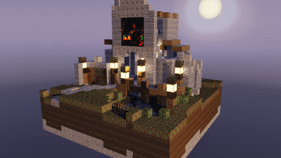

---

## Arquitectura del código

Módulos con una responsabilidad cada uno.

| Módulo | Responsabilidad |
| --- | --- |
| `math` | Vectores, base ortonormal, reflexión, Snell, Fresnel, hash reproducible y generador xorshift |
| `ray` | Rayos con recíproco precalculado, intervalos y estado del medio |
| `geometry` | AABB, test de rebanadas con caras, UV por cara y tabla de tangentes |
| `camera` | Orbitador con topes, zoom y recorrido guiado |
| `noise` | Ruido de valor, fbm, crestado, celular y direccional |
| `texture` | Muestreo por UV, sRGB a lineal y lectura de mapas normales |
| `texgen` | Generación de las texturas, los mapas normales y el cubemap |
| `material` | Los doce materiales y sus parámetros físicos |
| `skybox` | Cielo analítico, campo de estrellas, Vía Láctea, luna y cubemap |
| `acceleration` | Rejilla voxel densa con DDA y búsqueda exhaustiva de referencia |
| `lighting` | Luces, sombras con transmitancia, oclusión de contacto y emisores |
| `renderer` | Trazado recursivo, reparto de energía, tono y render por bloques |
| `terrain` | Terreno procedural de 24 × 24 |
| `scene` / `scene_build` | Composición del diorama y cantería con cubos |
| `image` | PPM de ida y vuelta, y escritura de PNG con `deflate` propio |
| `gif` | Cuantización, LZW y escritura de GIF animado |
| `platform` | Ventana Win32 por FFI |
| `config` | Análisis de la línea de comandos |
| `main` | Modos de ejecución |
| `tests/integracion` | Pruebas sobre el diorama completo |

---

## Materiales

Doce materiales, que cubren los siete que pide el encargo y cinco más de apoyo.
Los valores están en `src/material.rs` y las texturas en `assets/textures/`.

| Material | Textura | Mapa normal | Especular | Brillo | Reflectividad | Transp. | IOR | Emisión |
| --- | --- | :-: | ---: | ---: | ---: | ---: | ---: | --- |
| Piedra antigua | `stone_ancient` | sí | 0.05 | 18 | 0.025 | 0 | — | — |
| Losa de camino | `stone_floor` | sí | 0.08 | 28 | 0.035 | 0 | — | — |
| Escombro de piedra | `stone_rubble` | sí | 0.04 | 14 | 0.02 | 0 | — | — |
| Madera envejecida | `wood_aged` | sí | 0.10 | 34 | 0.022 | 0 | — | — |
| Tierra con musgo | `earth_moss` | sí | 0.02 | 8 | 0 | 0 | — | — |
| Tierra profunda | `earth_dark` | no | 0.015 | 6 | 0 | 0 | — | — |
| **Agua** | `water` | sí | 0.45 | 320 | 1.0 | 1.0 | 1.333 | — |
| **Vidrio de color** | `stained_glass` | no | 0.35 | 260 | 1.0 | 1.0 | 1.52 | — |
| **Bronce envejecido** | `metal_aged` | sí | 0.90 | 110 | 0.86 | 0 | — | conductor |
| **Farol emisivo** | `lantern_glow` | no | 0.06 | 20 | 0 | 0 | — | (1.00, 0.62, 0.30) × 13 |
| **Cristal del altar** | `altar_crystal` | no | 0.10 | 40 | 0 | 0 | — | (1.00, 0.80, 0.48) × 11 |
| Vegetación | `foliage` | no | 0.03 | 10 | 0 | 0 | — | — |

| Albedo | Mapa normal |
| --- | --- |
| 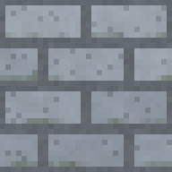 | 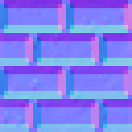 |
| 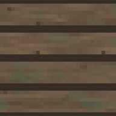 | 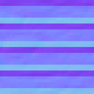 |
| 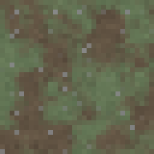 | 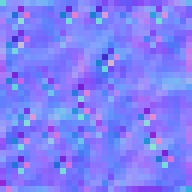 |
| 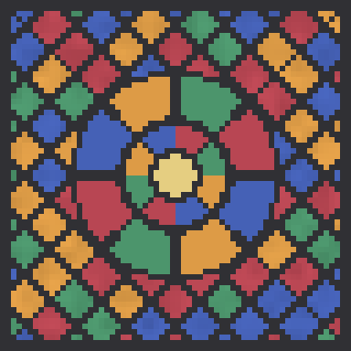 | *(sin relieve)* |

Las texturas son de 32 píxeles de lado (el vitral, 64), de modo que un bloque
mide 32 texels y el aspecto pixelado es consistente en toda la escena.

---

## Cómo está implementado cada efecto

### Reparto de energía

En cada impacto la energía se reparte, no se suma sin control:

- En un dieléctrico transmisivo, Fresnel decide la fracción `kr` que se refleja;
  lo que queda, `1 − kr`, se transmite multiplicado por la transparencia. Las dos
  ramas suman como mucho uno.
- En un dieléctrico opaco, esa misma `kr` pondera el entorno reflejado y `1 − kr`
  la componente difusa.
- En un conductor no hay componente difusa: toda la energía se va por el reflejo,
  teñido por el color del metal.

### Refracción

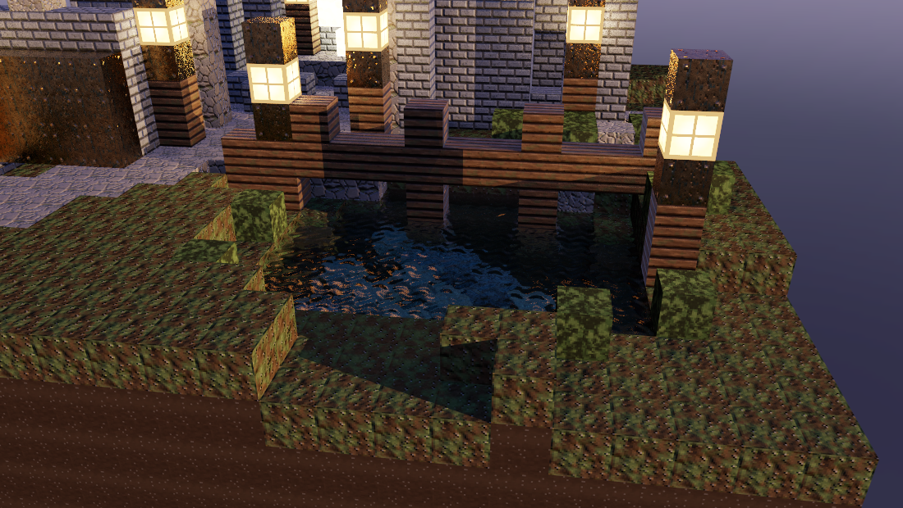

El índice del medio **viaja en la recursión**, no se deduce de la cara
impactada. Es la única forma de distinguir sin ambigüedad la entrada y la salida
de un volumen. Al entrar en el agua el rayo adopta su medio (índice 1.333 y
absorción (0.46, 0.14, 0.11)); al salir vuelve al aire. La absorción se aplica
por Beer‑Lambert sobre la distancia recorrida dentro del medio, y por eso el
fondo se ve más azul verdoso cuanto más lejos está.

Hay **piedras claras y oscuras colocadas bajo el agua** a propósito, y el
recorrido enmarca el estanque en oblicuo para que se vea su desplazamiento.
Cuando el ángulo supera el crítico, `refract` devuelve `None` y toda la energía
se refleja: eso es la reflexión interna total, y se comprueba en
`math::tests::reflexion_interna_total_por_encima_del_angulo_critico`.

**Interfaces falsas.** Un estanque hecho de muchos bloques de agua contiguos
produciría una refracción en cada junta. El recorrido DDA conoce el material a
los dos lados de cada cara y **solo considera superficie las caras entre
materiales distintos**, así que un volumen de agua o de vidrio se comporta como
un cuerpo único. Lo comprueba
`acceleration::tests::las_celdas_contiguas_del_mismo_medio_no_generan_interfaz`.

### Reflexión

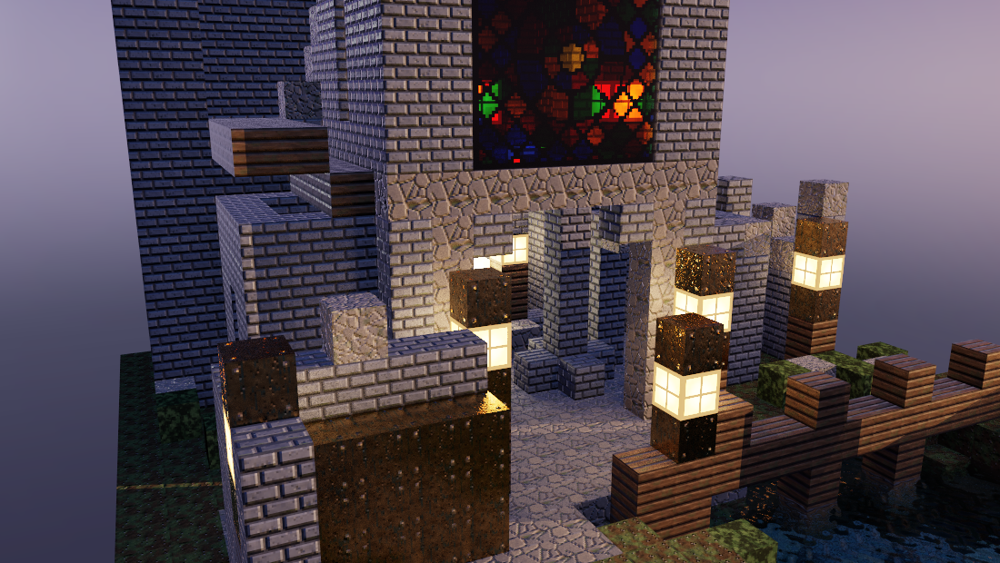

El reflejo no es un cambio de color: es un rayo trazado de verdad. En el
estanque se reconocen la pasarela, los postes y los faroles; en la placa de
bronce del atrio, que es la superficie grande de la izquierda, los faroles y la
fachada.

La dirección reflejada se dispersa según el exponente especular del material
muestreando el lóbulo de Phong, así que el mismo mecanismo da el espejo del agua
en calma (exponente 320) y el reflejo abierto del bronce picado (exponente 110).

Para los materiales opacos el reflejo rasante se resuelve con **una sola consulta
al cubemap**, sin recursión: para la piedra un rayo reflejado costaría tanto como
el primario y no cambiaría el píxel.

### Mapas normales

| Con mapas normales | Sin mapas normales |
| --- | --- |
| 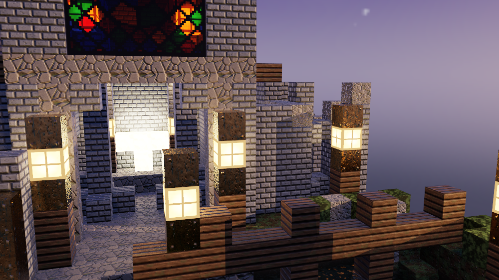 | 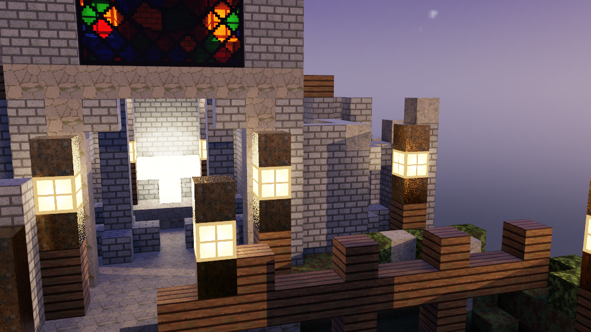 |

Son **mapas normales de verdad**, codificados en RGB como `n · 0.5 + 0.5`, y se
generan a partir de campos de altura por diferencias centrales con índices
circulares, de modo que el relieve continúa de un bloque al siguiente.

La normal leída está en **espacio tangente** y se lleva al espacio de la escena
con la base de la cara impactada. Esa base es una tabla constante: cada cara del
cubo tiene su tangente y su bitangente, que son las derivadas de la posición
respecto de `u` y de `v`. Las seis cumplen `T × B = N`, condición para que el
mapa no aparezca invertido en unas caras y correcto en otras;
`geometry::tests::la_tangente_es_la_derivada_de_la_posicion_respecto_de_u` lo
comprueba numéricamente.

La luz principal está a 14 grados de elevación precisamente para que **rase la
piedra** y el relieve se lea. `N` alterna los mapas en la ventana, y
`normals-compare` escribe las dos imágenes con el mismo encuadre.

### Material emisivo

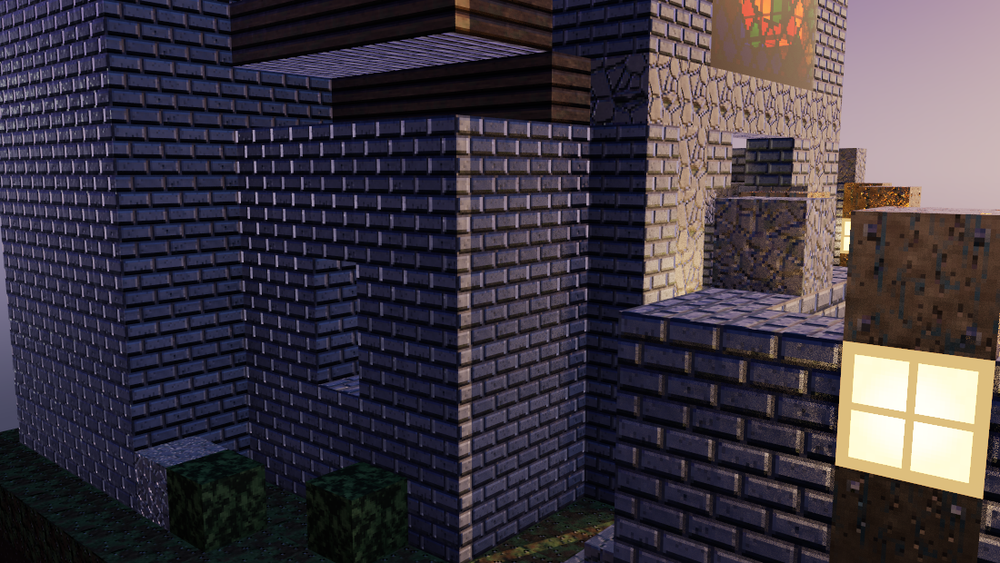

Los faroles y el altar **brillan por su propio material**: su emisión multiplica
la textura, así que el farol tiene núcleo caliente y celosía oscura en lugar de
ser un cubo de color plano.

Y además **iluminan lo que tienen cerca**, por muestreo explícito:

1. Al construir la escena se recorre la rejilla y **los bloques emisivos
   contiguos se agrupan** por caras compartidas en una sola luz de área, con su
   centro y el radio de la esfera que los envuelve. Así el altar ilumina como un
   cuerpo, no como varias fuentes puntuales solapadas.
2. En cada punto sombreado se ordenan los emisores **por importancia**
   (`luminancia · radio² / distancia²`) y se toman los cuatro mayores. Los que
   caen por debajo de un umbral se descartan: no moverían ni un nivel de los 256
   de la imagen final.
3. De cada uno se toman **dos muestras estratificadas** sobre su disco aparente,
   con un rayo de sombra por muestra. La estratificación importa más que el
   generador con tan pocas muestras: evita que las dos caigan juntas, que es lo
   que produce granulado en los bordes de sombra.
4. La aportación es `emisión · Ω / π · cos θ`, siendo `Ω` el ángulo sólido con el
   que se ve el emisor. Eso pone las luces de área y las direccionales en la
   misma escala.

Que el farol ilumine de verdad se comprueba en
`renderer::tests::el_emisor_ilumina_lo_que_tiene_al_lado`, que renderiza la misma
escena con y sin farol y mide la diferencia sobre el suelo.

### Skybox

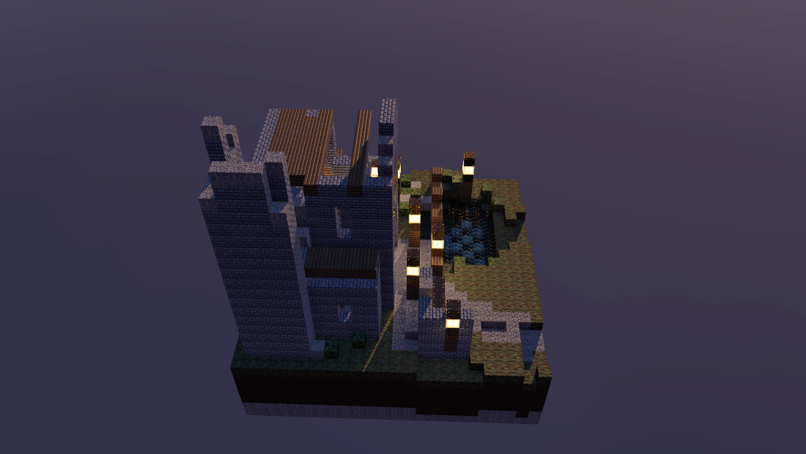

Cubemap de **seis caras de 512 × 512**, muestreado por dirección con filtrado
bilineal y bordes fijados.

El cielo se define una sola vez como una **función de la dirección**
(`skybox::sky_radiance`) y las caras se generan evaluándola, no pintando un
patrón por cara. Por eso la ausencia de costuras es estructural: dos caras
contiguas evalúan exactamente la misma dirección en su arista común. Hay dos
pruebas: una comprueba que escalar la dirección no cambia el resultado, y otra
genera las seis caras y compara los texels de borde de los doce pares contiguos.

Como el cielo solo se evalúa **al generar los recursos**, y no por píxel en el
render, puede permitirse mucho más detalle del que admitiría un fondo calculado
al vuelo. Cada texel se promedia con **nueve muestras**, que es lo que evita que
las estrellas, de uno o dos texels, parpadeen según caigan dentro o fuera del
centro.

| | |
| --- | --- |
| 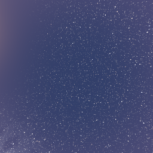 | 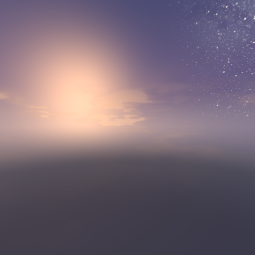 |
| Cenit: Vía Láctea y campo de estrellas | Poniente: cirros teñidos y resplandor |

Lo que compone el cielo, de fondo a primer plano:

- **Degradado vertical**: cenit azul profundo, franja media violeta y horizonte
  más claro, con **bruma índigo** por debajo del horizonte para que la silueta
  del diorama se apoye en algo y no en negro puro.
- **Campo de estrellas** sembrado sobre una retícula tridimensional de
  direcciones: se recorre la celda que contiene la dirección y sus veintiséis
  vecinas, y cada una decide por hash si alberga una estrella. Así cada estrella
  tiene posición, tamaño, brillo y color propios, en tres capas de densidad
  decreciente. El color sigue el reparto real de **clases espectrales**: abundan
  las anaranjadas y amarillas y las azules son pocas.
- **Vía Láctea**: una banda alrededor del ecuador galáctico, con el polo
  inclinado para que cruce el cielo en diagonal. Lleva grumos a lo largo y
  **vetas oscuras de polvo** que la parten longitudinalmente; sin ellas parece
  una brocha y no una galaxia vista de canto. Dentro de la banda la densidad de
  siembra de estrellas sube a más del doble, porque lo que se ve a simple vista
  es justamente la suma de miles de estrellas que el ojo no resuelve.
- **Luna** resuelta como esfera, no como círculo: de cada punto del disco se
  deduce la normal de la superficie, y con ella se calculan la iluminación del
  sol —que recorta la **fase**, gibosa con la posición actual del sol— y el
  **oscurecimiento hacia el limbo**. Encima van los **mares**, manchas de basalto
  que dependen solo de la posición sobre la superficie.
- **Cirros** estirados en horizontal: la coordenada vertical se multiplica antes
  de entrar al ruido, porque una nube alta se ve alargada al mirarla de canto. Se
  pintan **después** del resplandor del poniente, así que los de encima del sol
  recogen el ámbar por debajo y llevan el filo encendido, mientras que los
  opuestos se quedan en violeta frío. Eso es lo que ordena el cielo en
  profundidad, porque dice de dónde viene la luz.
- **Resplandor del poniente**, con núcleo estrecho y halo ancho pegados al
  horizonte por una caída exponencial en altura.

El entorno se ve **directamente** y también **en los reflejos**: el agua y el
bronce lo devuelven, y los materiales opacos lo consultan para su reflejo
rasante y para la luz ambiente.

### Sombras y oclusión

El rayo de sombra **no devuelve un booleano sino una transmitancia**: un opaco la
anula, pero el agua y el vidrio dejan pasar su fracción atenuada por
Beer‑Lambert. Por eso el vitral proyecta luz de color en lugar de una sombra
plana.

Además hay **oclusión de contacto** entre bloques vecinos, con la técnica clásica
de los mundos de voxels: la sombra de cada esquina se deduce de si están ocupados
los dos bloques laterales y el diagonal, y se interpola por las coordenadas de la
cara. Cuesta ocho consultas a la rejilla, ni un rayo, y es lo que hace que los
arcos y los contrafuertes se despeguen del muro.

---

## Terreno procedural

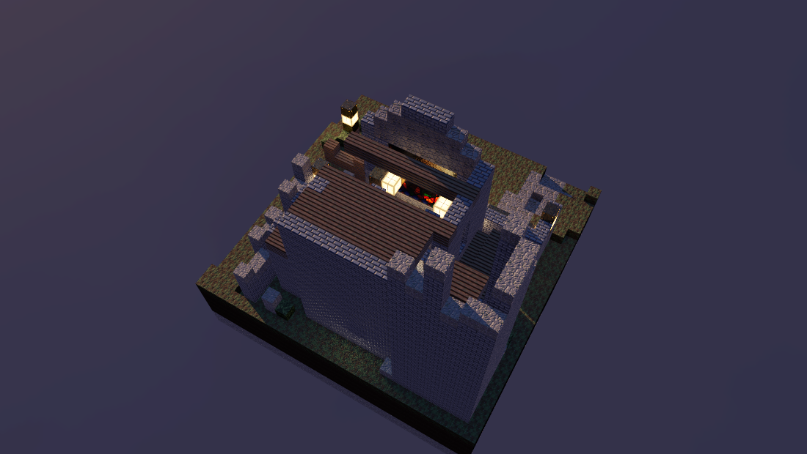

Base de **24 × 24 celdas**, por encima del mínimo de 16 × 16 que pide la rúbrica.

- Cuatro octavas de **ruido de valor** interpolado con la quíntica de Perlin. Se
  usa la quíntica y no interpolación lineal porque esta última deja visibles las
  aristas de la retícula en forma de escalones rectos.
- Todo el azar sale del mismo mezclador entero, así que el ruido es una **función
  pura de las coordenadas y de la semilla**: no hay tablas que inicializar y el
  resultado es idéntico en cualquier máquina.
- La semilla se cambia desde la línea de comandos con `--seed`.
- **Tres capas de material** según la profundidad: musgo o tierra desnuda en
  superficie, subsuelo, y roca madre en las últimas hiladas.
- **Depresión del estanque** con perfil de cubeta (fondo plano y taludes), y
  **meseta estable para los cimientos** de la abadía.
- La vegetación y los escombros se reparten con **reglas reproducibles**: un
  valor de hash por columna, y siempre después de levantar la arquitectura,
  exigiendo apoyo de terreno y celda libre encima. Así nada brota dentro de un
  muro ni flota sobre un talud.

Tres rasgos son **composición, no azar**, y no cambian con la semilla: la meseta,
la cubeta del estanque y el borde del diorama. Hay una prueba que lo verifica con
cuatro semillas distintas.

La arquitectura se coloca a mano sobre ese terreno, bloque a bloque. Los arcos,
las escaleras y los contrafuertes **no son primitivas**: el arco redondea el
perfil de una circunferencia sobre la retícula entera, que es justo lo que produce
la escalera de bloques.

```bash
cargo run --release -- render --seed 12345 --out isla-12345.png
cargo run --release -- render --seed 99999 --out isla-99999.png
```

---

## Mediciones reales

### Por qué una rejilla voxel y no una BVH

Toda la geometría del diorama son **cubos unitarios sobre una retícula entera**.
Para esa geometría la rejilla gana: la celda que ocupa un punto se obtiene con una
parte entera, así que la consulta es O(1) exacta y no hay descenso por un árbol;
no hay coste de construcción ni heurística de partición; y como las cajas no se
solapan ni dejan huecos, el recorrido de **Amanatides y Woo** visita las celdas en
orden estricto de distancia y puede parar en la primera superficie. Una BVH sobre
miles de cajas iguales degeneraría en muchos nodos con volumen vacío y obligaría a
mantener una pila por rayo.

Y resuelve un problema que no es de rendimiento: al recorrer celda a celda se
conoce el material a ambos lados de cada cara, que es lo que permite descartar las
interfaces falsas dentro del estanque y del vitral.

Que el recorrido acelerado sea correcto no se da por supuesto: hay una **búsqueda
exhaustiva independiente**, que no comparte nada con él, y dos pruebas comparan
ambas implementaciones sobre miles de rayos aleatorios.

### Entorno de medición

Medido en release en **esta** máquina. No son extrapolaciones.

- **CPU**: Intel Core Ultra 9 285H, 16 núcleos, 16 hilos lógicos
- **SO**: Windows 11 Home 10.0.26200
- **Rust**: 1.97.1, perfil release con LTO completo y una unidad de codegen
- **Escena**: 4880 celdas ocupadas de 18 432, 15 grupos emisores
- **Comando**: `cargo run --release -- benchmark`

### Barrido de calidad, 16 hilos

| Ancho | Alto | Muestras/px | Profundidad | Bloques | Tiempo (s) | Mrayos/s |
| ---: | ---: | ---: | ---: | ---: | ---: | ---: |
| 640 | 360 | 1 | 3 | 240 | 0.02 | 13.1 |
| 640 | 360 | 4 | 5 | 240 | 0.07 | 14.0 |
| 1280 | 720 | 1 | 3 | 920 | 0.06 | 14.9 |
| 1280 | 720 | 4 | 5 | 920 | 0.21 | 17.2 |
| 1280 | 720 | 9 | 5 | 920 | 0.45 | 18.4 |
| 1920 | 1080 | 9 | 5 | 2040 | 0.99 | 18.8 |

### Escalado con los hilos, 1280 × 720 con 4 muestras

| Hilos | Tiempo (s) | Mrayos/s | Aceleración |
| ---: | ---: | ---: | ---: |
| 1 | 2.02 | 1.82 | 1.00× |
| 2 | 1.02 | 3.62 | 1.98× |
| 4 | 0.52 | 7.10 | 3.90× |
| 8 | 0.30 | 12.44 | 6.83× |
| 16 | 0.21 | 17.38 | **9.54×** |

La aceleración se aparta de la ideal a partir de ocho hilos, lo que es lo
esperable en un procesador con núcleos de rendimiento y de eficiencia mezclados:
los bloques que caen en un núcleo lento tardan más y el reparto dinámico solo
puede compensarlo en parte.

Otras medidas tomadas al preparar la entrega:

| Trabajo | Ajustes | Tiempo |
| --- | --- | ---: |
| Captura principal | 1400 × 788, 25 spp, profundidad 8 | 4.3 s |
| Recorrido completo | 854 × 480, 16 spp, 150 fotogramas | 47 s |
| GIF animado | 480 × 270, 9 spp, 96 fotogramas, con paleta y LZW | 8.7 s |

---

## Pruebas

```
cargo test
```

**236 pruebas**: 222 unitarias repartidas por los módulos y 14 de integración
sobre el diorama completo. Además `cargo clippy --all-targets` no emite ni una
advertencia.

Cubren, entre otras cosas:

- Intersección de cubos desde fuera y desde dentro, rayos exactamente paralelos a
  las caras y rayos que nacen sobre el plano de una cara.
- Reflexión, refracción por Snell y reflexión interna total por encima del ángulo
  crítico.
- **Correspondencia entre el recorrido acelerado y la búsqueda exhaustiva**, con
  miles de rayos aleatorios, incluida la escena real.
- Generación reproducible del terreno, y que la semilla cambia el relieve pero no
  los rasgos deliberados.
- Que el reparto entre hilos no altera la imagen.
- Que la vista inicial **no está subexpuesta** y encuadra abadía, agua y luces.
- Que ninguna semilla deja bloques flotando.
- Ida y vuelta del compresor `deflate` y del LZW del GIF, cada uno contra un
  descompresor escrito en las propias pruebas.

Hay además una prueba marcada `#[ignore]` que vuelca el mapa de alturas en texto,
para poder mirar el terreno al ajustar la composición:

```bash
cargo test --lib -- --ignored --nocapture mapa_del_terreno
```

---

## Tabla de rúbrica y evidencias

| Criterio | Puntos | Estado | Dónde se ve |
| --- | ---: | :-: | --- |
| Complejidad de la escena | 20 | Hecho | Nave con naves laterales, torre derrumbada, arcos, columnas, contrafuertes, claustro en ruinas, estanque, pasarela, camino, atrio, camposanto. 4880 celdas ocupadas. [Captura principal](docs/images/abadia.png) |
| Apariencia visual | 15 | Hecho | Paleta del encargo, curva tonal fílmica con hombro, oclusión de contacto. [Captura principal](docs/images/abadia.png) |
| Programación paralela y optimización | 10 | Hecho | Rejilla voxel con DDA, bloques con reparto dinámico, 9.54× con 16 hilos. [Mediciones](#mediciones-reales) |
| Rotación y acercamiento de cámara | 10 | Hecho | Orbitador con topes y zoom multiplicativo. [Recorrido](docs/images/recorrido.gif), [rotación](docs/images/ev-rotacion.png), [alejamiento](docs/images/ev-alejamiento.png) |
| Cinco materiales diferentes | 25 | Hecho | Doce materiales, siete de ellos los que pide el encargo. [Tabla de materiales](#materiales) |
| Refracción | 10 | Hecho | Snell, reflexión interna total, medios con Beer-Lambert. [Agua](docs/images/ev-agua.png), [vitral](docs/images/ev-vitral.png) |
| Reflexión | 5 | Hecho | Reflejo recursivo con Fresnel y lóbulo según el exponente. [Agua](docs/images/ev-agua.png), [placa de bronce](docs/images/ev-bronce.png) |
| Mapas normales | 10 | Hecho | RGB en espacio tangente, base por cara. [Comparación con y sin](#mapas-normales) |
| Material emisivo | 10 | Hecho | Emisión propia más muestreo explícito por importancia. [Emisores](docs/images/ev-emisores.png) |
| Skybox | 10 | Hecho | Cubemap de seis caras a 512 sin costuras, con Vía Láctea, luna con fase y cirros. Visible y en reflejos. [Skybox](docs/images/ev-skybox.png) |
| Terreno procedural de 16 × 16 o más | 20 | Hecho | 24 × 24 con semilla configurable. [Terreno](docs/images/ev-terreno.png) |
| Repositorio en GitHub | — | Hecho | Este repositorio |
| Video demostrativo en el README | — | Hecho | [MP4 de 20 s a 720p](docs/video/abadia-del-eclipse.mp4), más [GIF animado](#vista-previa-animada) para verlo en línea |

---

## Limitaciones conocidas

- **La iluminación global es directa.** No hay rebotes difusos: lo que no ve una
  luz se apoya en el ambiente del cubemap y en la oclusión de contacto. Un
  interior profundo se ve más plano de lo que se vería con trazado de caminos.
- **La sombra de los emisores es dura en los bordes.** Con dos muestras por
  emisor la penumbra tiene algo de granulado en los primeros planos; sube con
  `--samples`, pero el número de muestras por emisor no está expuesto en la línea
  de comandos.
- **El reflejo de los materiales opacos es solo del entorno.** La piedra y la
  madera consultan el cubemap, no trazan un rayo, así que no se reflejan entre
  ellas. Es una decisión de coste, explicada en `renderer.rs`.
- **El vidrio no proyecta cáusticas.** La luz que lo atraviesa se tiñe y se
  atenúa, pero no se concentra.
- **La ventana solo existe en Windows.** El modo `render` es independiente y
  compila en cualquier sistema.
- **La textura se repite una vez por bloque**, salvo el vitral. Es la estética
  buscada, pero en superficies grandes la repetición se nota; se mitiga con
  variación por bloque, no se elimina.
- **El GIF tiene 256 colores.** El tramado ordenado rompe las bandas, pero el
  degradado del cielo pierde finura frente al PNG.

### Un punto de interpretación que conviene confirmar

La ventana interactiva usa **FFI directo a `user32`, `gdi32` y `kernel32`**, que
son las API del propio sistema operativo y no bibliotecas de terceros. No se usa
ningún crate para ello. **Queda por confirmar con el profesor** si la restricción
de no usar librerías externas admite esta vía.

Esa incertidumbre no afecta a la entrega: el modo `render` no toca ese módulo y
compila en cualquier sistema. Si la interpretación fuera estricta, basta con no
compilar `platform.rs` y el proyecto sigue cumpliendo el resto de la rúbrica.

